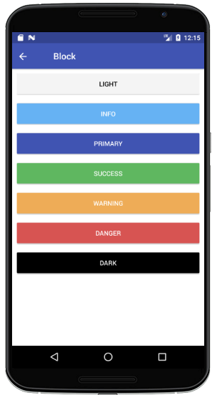
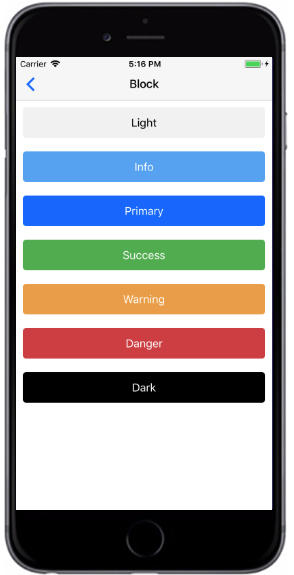

# Block Button
块级按钮，跨越父元素的整个宽度。通过添加`block` prop来创建块级按钮Button

###### Styntax

```
import React, { Component } from 'react';
import { Container, Header, Content, Button } from 'react-native-ecpei-widgets';
export default class ButtonThemeExample extends Component {
  render() {
    return (
      <Container>
        <Header />
        <Content>
          <Button block light title="Light" />
          <Button block title="Primary" />
          <Button block success title="Success" />
          <Button block info title="Info" />
          <Button block warning title="Warning" />
          <Button block danger title="Danger" />
          <Button block dark title="Dark" />
        </Content>
      </Container>
    );
  }
}
```

##### 示例：
<br />

<div align=center >

 
</div>