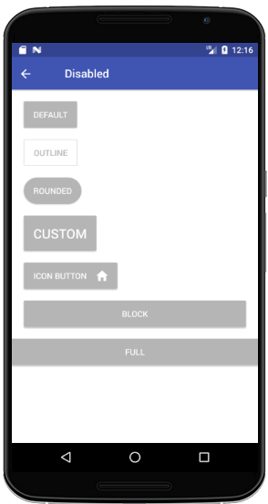
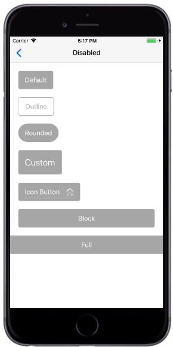

# Disabled Button
禁用的按钮无法使用且无法点击。NativeBase Button 
的`disabled` prop是boolean类型。如果存在，则指定应禁用该按钮。可以将禁用的道具设置为阻止用户点击按钮，直到满足某些其他条件（例如选择复选框等）。然后，条件代码可以删除禁用的值，并使按钮可用。

###### Styntax

```
import React, { Component } from 'react';
import { Container, Header, Content, Button } from 'react-native-ecpei-widgets';
export default class ButtonThemeExample extends Component {
  render() {
    return (
      <Container>
        <Header />
        <Content>
          <Button disabled title="Default" />
          <Button disabled bordered title="Outline" />
          <Button disabled rounded title="Rounded" />
          <Button disabled large title="Custom" />
          <Button disabled iconRight title="Icon Button" name="home" />
          <Button disabled block title="Block" />
          <Button disabled full title="Full" />
        </Content>
      </Container>
    );
  }
}
```

##### 示例：
<br />

<div align=center >

 
</div>