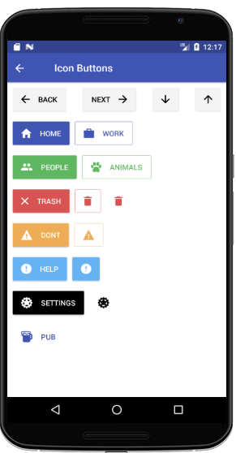
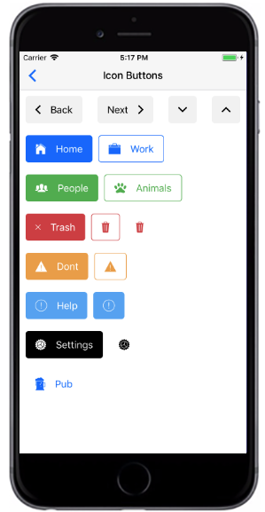

# Icon Button
`iconLeft ` `iconRight ` 分别为Icon Button属性，区分Icon图标左右位置，Icon图标使用的是EcpeiWidgets定制的Icon，抛弃了NativeBase中使用的Icon。

###### Styntax

```
import React, { Component } from 'react';
import { Container, Header, Content, Button } from 'react-native-ecpei-widgets';
export default class ButtonThemeExample extends Component {
  render() {
    return (
      <Container>
        <Header />
        <Content>
          <Button iconLeft light title="Back" name="return" size={16} color="#000" />
          <Button iconRight light title="Next" name="next" size={16} color="#000" />
          <Button iconLeft title="Home" name="home" size={16} color="#000" />
          <Button iconLeft transparent primary title="Pub" 
          name="home" size={16} color="#000" />
        </Content>
      </Container>
    );
  }
}
```

##### 示例：
<br />

<div align=center >

 
</div>