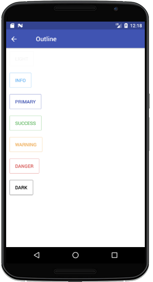
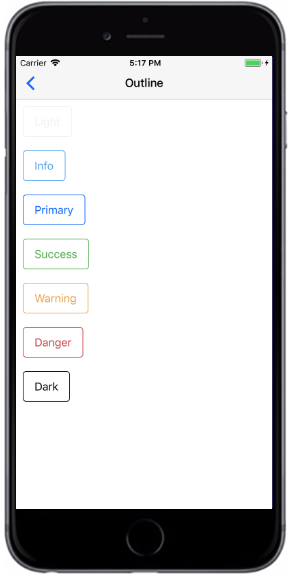

# Outline Button
`bordered`  Button属性，边框样式。

###### Styntax

```
import React, { Component } from 'react';
import { Container, Header, Content, Button } from 'react-native-ecpei-widgets';
export default class ButtonThemeExample extends Component {
  render() {
    return (
      <Container>
        <Header />
        <Content>
          <Button bordered light title="Light" />
          <Button bordered title="Primary" />
          <Button bordered success title="Success" />
          <Button bordered info title="Info" />
          <Button bordered warning title="Warning" />
          <Button bordered danger title="Danger" />
          <Button bordered dark title="Dark" />
        </Content>
      </Container>
    );
  }
}

```


##### 示例：
<br />

<div align=center >

&nbsp;&nbsp;&nbsp;&nbsp;&nbsp;&nbsp;&nbsp;
 
</div>