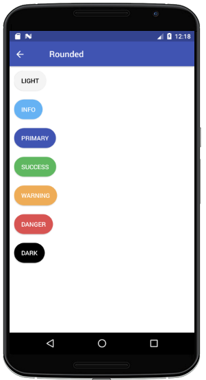
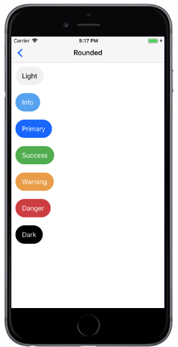

# Rounded Button
`rounded `  Button属性，Button设计带有略微圆形边缘的按钮。

###### Styntax

```
import React, { Component } from 'react';
import { Container, Header, Content, Button } from 'react-native-ecpei-widgets';
export default class ButtonThemeExample extends Component {
  render() {
    return (
      <Container>
        <Header />
        <Content>
          <Button rounded light title="Light" />
          <Button rounded title="Primary" />
          <Button rounded success title="Success" />
          <Button rounded info title="Info" />
          <Button rounded warning title="Warning" />
          <Button rounded danger title="Danger" />
          <Button rounded dark title="Dark" />
        </Content>
      </Container>
    );
  }
}
```

##### 示例：
<br />

<div align=center >

 
</div>