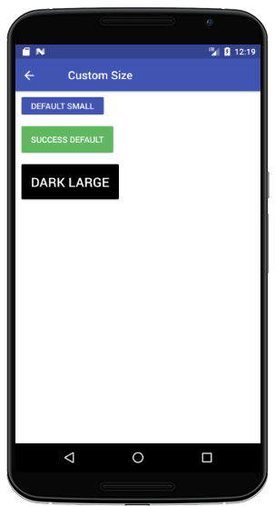
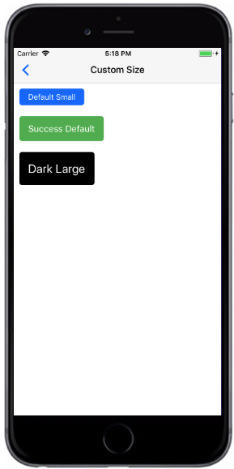

# Button Size
按钮尺寸大小，在没有使用以下两属性时，按钮大小为默认尺寸。

+ `small`：适用于小尺寸按钮
+ `large`：适用于大尺寸按钮

###### Styntax

```
import React, { Component } from 'react';
import { Container, Header, Content, Button } from 'react-native-ecpei-widgets';
export default class ButtonThemeExample extends Component {
  render() {
    return (
      <Container>
        <Header />
        <Content>
          <Button small primary title="Default Small" />
          <Button success title="Success Default" />
          <Button large dark title="Dark Large" />
        </Content>
      </Container>
    );
  }
}
```

##### 示例：
<br />

<div align=center >

 
</div>