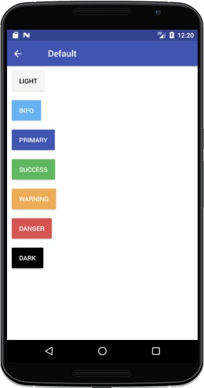
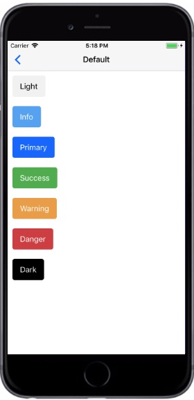

# Button Theme

NativeBase提供多种颜色的按钮。

NativeBase提供以下颜色主题：

+ Primary (default)
+ Success
+ Info
+ Warning
+ Danger
+ Light
+ Dark

###### Synatx

```
import React, { Component } from 'react';
import { Container, Header, Content, Button } from 'react-native-ecpei-widgets';
export default class ButtonThemeExample extends Component {
  render() {
    return (
      <Container>
        <Header />
        <Content>
          <Button light title="Light" />
          <Button primary title="Primary" />
          <Button success title="Success" />
          <Button info title="Info" />
          <Button warning title="Warning" />
          <Button danger title="Danger" />
          <Button dark title="Dark" />
        </Content>
      </Container>
    );
  }
}
```


##### 示例：
<br />

<div align=center >

&nbsp;&nbsp;&nbsp;&nbsp;&nbsp;&nbsp;&nbsp;
 
</div>