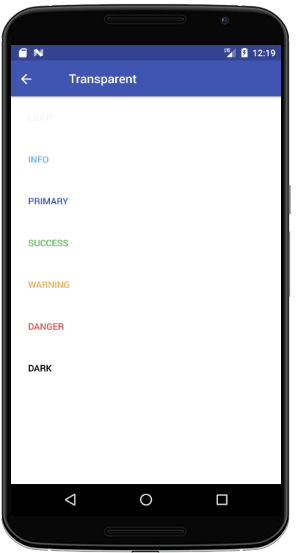
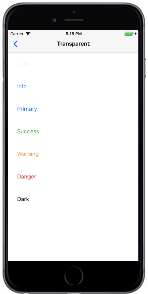

# Transparent Button

`transparent` 为Button组件的属性，这将呈现没有边框且没有背景颜色的按钮。

###### Syntax

```
import React, { Component } from 'react';
import { Container, Header, Content, Button } from 'react-native-ecpei-widgets';
export default class ButtonThemeExample extends Component {
  render() {
    return (
      <Container>
        <Header />
        <Content>
          <Button transparent light title="Light" />
          <Button transparent title="Primary" />
          <Button transparent success title="Success" />
          <Button transparent info title="Info" />
          <Button transparent warning title="Warning" />
          <Button transparent danger title="Danger" />
          <Button transparent dark title="Dark" />
        </Content>
      </Container>
    );
  }
}

```

##### 示例：
<br />

<div align=center >

&nbsp;&nbsp;&nbsp;&nbsp;&nbsp;&nbsp;&nbsp;
 
</div>