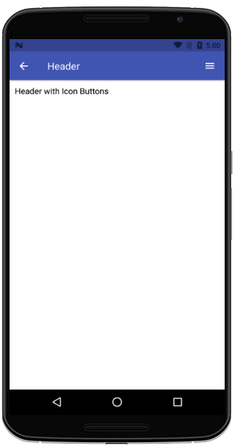
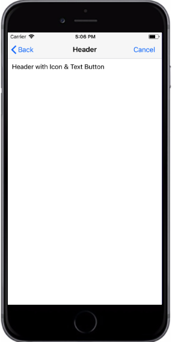

# 图标文字同侧按钮导航栏

##### 所用到属性：
|属性|默认值|参数类型|描述|
|---|---|---|---|
|title|Header|string|导航栏标题|
|titleStyle|-|any|导航栏标题字体样式|
|transparent|-|boolean|导航栏透明|
|style|-|any|导航栏样式|
| noShadow |-|boolean|无阴影样式|
|letfTitle|-|boolean|是否显示导航栏左侧文字（不与leftIcon同用）|
|letfText|"Left"|string|左侧文字|
|leftTextStyle|-|any|左侧文字样式|
|leftIcon|-|boolean|是否显示导航栏左侧图标|
|leftOnPress|-|func|左侧按钮点击function|
|leftIconProps|-|object|左侧图标相关属性（leftIconProps={<br />name:"home",color:"#000000",size={16}<br />}）|
|rightContents|-|array|右侧文字按钮（可显示多个文字）[{ <br />rightTitle: true,//显示文字的数据<br />onPress: () => { },<br /> titleData: {<br /> title: "右侧",<br /> style: {//按钮文本样式<br />color: '#000',fontSize: 14,<br />&nbsp;&nbsp;&nbsp;&nbsp; }<br />&nbsp;&nbsp; }<br />},{ <br />rightTitle: true,//显示文字的数据<br />onPress: () => { },<br /> titleData: {<br /> title: "右侧",<br /> style: {//按钮文本样式<br />color: '#000',fontSize: 14,<br />&nbsp;&nbsp;&nbsp;&nbsp; }<br />&nbsp;&nbsp; }<br />}]|


**注意：** 

+ 左侧图文同侧，样式是图标在最左侧，然后文字；右侧可自由调节；
+ `leftOnPress ` 回调函数如果图文都有的话，其实就是两个点击事件，此函数会传出参数index用于区分,图标index为0，文字index为1。

###### 代码语法

```
import React, { Component } from 'react';
import { Container, Header} from 'react-native-ecpei-widgets';
export default class HeaderTitleExample extends Component {
  render() {
    return (
      <Container>
        <Header leftIcon style={{backgroundColor:"transparent"}} 
                title="Header"
                leftIconProps={name:"return",color:"#000",size:15}
                letfTitle
                letfText={"Back"}
                leftOnPress={(index)=>{alert(index)}}
                titleStyle={{color:"#000000"}}>
                rightContents={[{
                  rightIcon: true,
                  onPress: () => { },
                  iconData: {
                   color: "#000",
                   name: "return",
                   size: 16,
                   }
                 }
                 
                ]}
        </Header>
      </Container>
    );
  }
}
```

##### 示例：
<br />

<div align=center >

 
</div>

