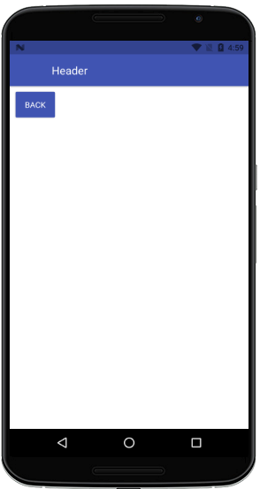
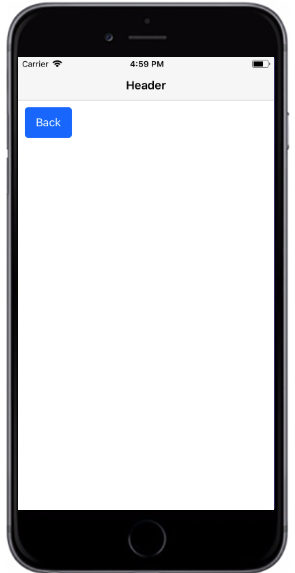

# 只有标题的导航栏

##### 所用到属性：
|属性|默认值|参数类型|描述|
|---|---|---|---|
|title|Header|string|导航栏标题|
|titleStyle|-|any|导航栏标题字体样式|
|transparent|-|boolean|导航栏透明|
|style|-|any|导航栏样式|
| noShadow |-| boolean |无阴影样式|

###### 代码语法

```
import React, { Component } from 'react';
import { Container, Header} from 'react-native-ecpei-widgets';
export default class HeaderTitleExample extends Component {
  render() {
    return (
      <Container>
        <Header transparent noShadow style={{backgroundColor:"transparent"}} 
                title="Header"
                titleStyle={{color:"#000000"}}>
        </Header>
      </Container>
    );
  }
}
```

##### 示例：
<br />

<div align=center >

 
</div>