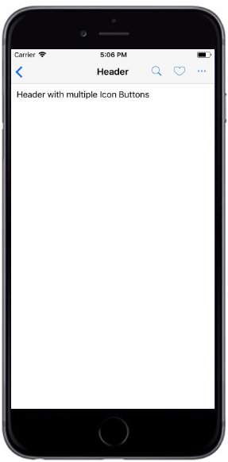

# 右侧多图标按钮导航栏

##### 所用到属性：
|属性|默认值|参数类型|描述|
|---|---|---|---|
|title|Header|string|导航栏标题|
|titleStyle|-|any|导航栏标题字体样式|
|transparent|-|boolean|导航栏透明|
|style|-|any|导航栏样式|
| noShadow |-|boolean|无阴影样式|
|leftIcon|-|boolean|是否显示导航栏左侧图标|
|leftOnPress|-|func|左侧按钮点击function|
|leftTextStyle|-|any|左侧文字样式|
|rightContents|-|array|右侧图标按钮（可显示多个图标）[{ <br />rightIcon:true,//显示图标的数据<br />onPress: () => { },<br />iconData: {<br />color: "#000",<br /> name: "return1",<br />size: 16,<br /> },{ <br />rightIcon:true,//显示图标的数据<br />onPress: () => { },<br />iconData: {<br />color: "#000",<br /> name: "return2",<br />size: 16,<br /> }<br />}]|


###### 代码语法

```
import React, { Component } from 'react';
import { Container, Header} from 'react-native-ecpei-widgets';
export default class HeaderTitleExample extends Component {
  render() {
    return (
      <Container>
        <Header leftIcon style={{backgroundColor:"transparent"}} 
                title="Header"
                leftIconProps={name:"return",color:"#000",size:15}
                leftOnPress={()=>{alert(11)}}
                rightContents={[{
                  rightIcon: true,
                  onPress: () => { },
                  iconData: {
                   color: "#000",
                   name: "return1",
                   size: 16,
                   }
                 },
                 {
                  rightIcon: true,
                  onPress: () => { },
                  iconData: {
                   color: "#000",
                   name: "return2",
                   size: 16,
                   }
                 },
                 {
                  rightIcon: true,
                  onPress: () => { },
                  iconData: {
                   color: "#000",
                   name: "return3",
                   size: 16,
                   }
                 }
                ]}
        </Header>
      </Container>
    );
  }
}
```

##### 示例：
<br />

<div align=center >

 
</div>