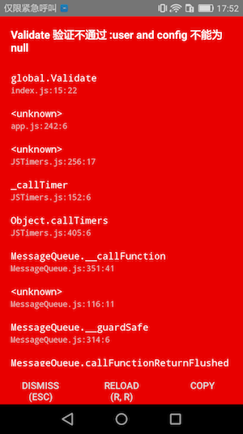
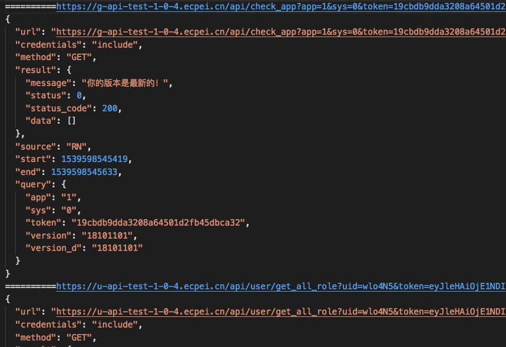

DevModuleManager

```
作为辅助开发模块，仅仅在debug版本中会生效
```

> DevModuleManager 管理器

> DevModule 调试模块的基类


* DevModuleManager
	* 管理调试模块
	* 接受配置参数
		* 接受RypYo.registerBoots第三个参数(Config.dev)作为调试环境参数
		* 参数会传递给各个模块

		```
		import { RypYo } from "react-native-ecpei-framework";
		
		RypYo.registerBoots("com.ryp.rn.core", AppModule, Config={
		    dev: {    	
		    }
		})
		```
		
* DevModule 调试模块
	
	> 作为辅助开发类
	
	> 在debug 版本中运行
	
	* DevModule
	
		```
		class DevModule {
			constructor(name,disable){
				name配置在全局配置得到对应配置
				disable是否开启开模块
			}
		    run(isEnv,config){
		    	isEnv 表示是否为开发环境
		    	config DevModuleManager传递的参数
		    }
		}
		```
	* 默认模块：RNValidate 进行代码验证
	
		```
		export default class RNValidate extends DevModule {
		    run = (isEnv) => {
		        if (!isEnv) return;
		        global.Validate = function (...args) {
		            desc = args.pop()
		            if (!args.reduce((one, two) => { return (one && two) }, true)) {
		                throw new Error("RNValidate 不通过 " + desc)
		                return
		            }
		        }
		    }
		}
		
		取所有条件的并集,来判断条件是否满足
		
		Dome:
			let user = null;
			let config = null;
			Validate(user,config,"user and config 不能为null");
			login(user,config)
		效果见下图
		```
		
		
	
	* 默认模块：AjaxIntercept 拦截所有网络请求
		> 拦截RN | H5 所有网络请求 作为日志
		
		* 如何将网络日志序列化到本地
		
		```
		//new AjaxIntercept("WebLog")接受WebLog参数
		
		进行调试模块的配置
			RypYo.registerBoots("com.ryp.rn.core", AppModule, {
			    dev: {
			    	WebLog:{
			    		websocket:"ws://172.18.0.201:8888",
				    	disable:false
			    	}
			    	
			    }
			})
		mac:
			解压WebLog.zip
			运行 npm i
			运行 npm run start(开启服务)
		phone:
			拦截到网络日志会将日志传递到WebLog.websocket对应的地址上
		```
			

		
* 如何手动编写自定义调试模块
	
	```
	编写代码
		import { DevModule, DevModuleManager } from "react-native-ecpei-framework";
		class DevConsole extends DevModule{
			run(isEnv,config){
				//config == DevLog(见配置)
		        if(isEnv){
		            const _console = console;
		            global.console = {
		                ..._console,
		                log:()=>{
		                    
		                }
		            }
		        }
		    }
		}
	
	注册模块
		DevModuleManager.addModule(new DevConsole("DevLog"))
	配置
		RypYo.registerBoots("com.ryp.rn.core", AppModule, {
		    dev: {
		    	DevLog:{
			    	disable:false,
			    	xx:"",
			    	.....
		    	}
		    	
		    }
		})
	
	```
		
		
		
		
