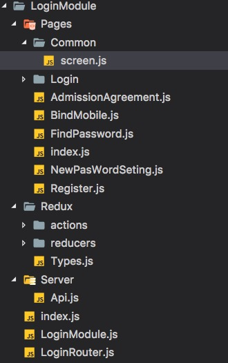

<div style = "text-align:center;font-size:2rem"></div>
模块编写规范

* Chat模块名为例

  ```
  ChatModule(模块文件夹)
  	index.js 
  	ChatModule.js 模块
  	ChatRouter.js  模块路由
  	Redux
  		Types.js (集中管理Redux type)
  		actions
  			ChatActions.js (生成action 然后派发)
  		reducers
  			ChatReducers.js (处理派发的action 更新Redux)
  	Pages (模块页面)
  		index.js 页面导出
  		PageA
  			index.js(页面主入口)
  			Views（单页面组件）
  		PageB.js
  		common 管理当前页面下的公共文件
  			Views(视图组件)
  			tools（公共工具类）
  			index.js（导出）
  ```

* 结构图

 

* 如何加入一个模块

	* 在父模块中增加入口
	* 在Redux 进行注册

* 模块生成cli

	> 在 RypYo-Module-cli 目录下, 执行 "npm link" 链接命令
	
	> cd 切换到目标文件夹下
	
	> RypYo create 模块名称 （RypYo create Chat）。 该目录下就会生成模块文件和内容。
	