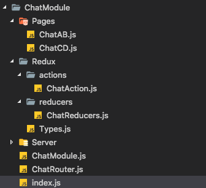

<div style = "text-align:center;font-size:2rem"></div>
模块编写规范

* Chat模块名为例

	```
	ChatModule(模块文件夹)
		index.js 
		ChatModule.js 模块
		ChatRouter.js  模块路由
		Redux
			Types.js (集中管理Redux type)
			actions
				ChatActions.js (生成action 然后派发)
			reducers
				ChatReducers.js (处理派发的action 更新Redux)
		Server(网络请求)
			Api.js
		Pages (模块页面)
			PageA.js
			PageB.js
	 ```	

* 结构图

 
 
* 如何加入一个模块

	* 在父模块中增加入口
	* 在Redux 进行注册

* 模块生成cli

	> 在 RypYo-Module-cli 目录下, 执行 "npm link" 链接命令
	
	> cd 切换到目标文件夹下
	
	> RypYo create 模块名称 （RypYo create Chat）。 该目录下就会生成模块文件和内容。
	