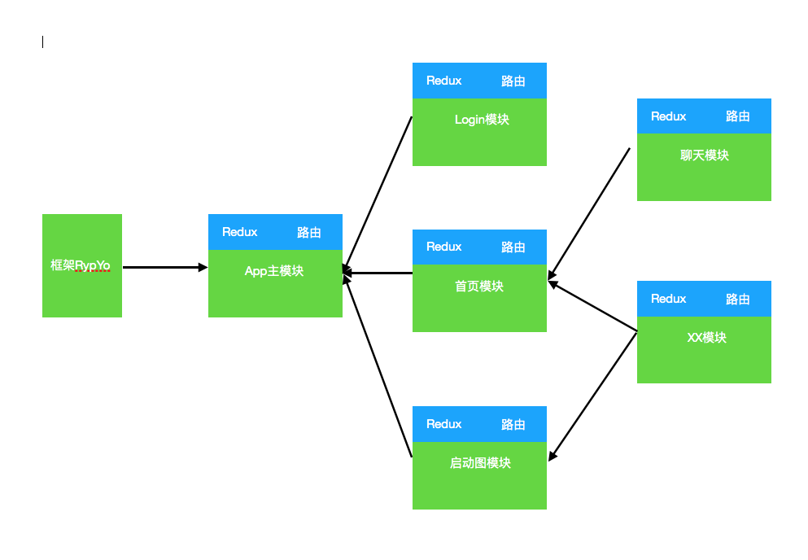

<div style = "text-align:center;font-size:2rem">RypYo</div>


		
* 思路设计

	* 框架启动
	
		```
		暂时仅仅依赖 
			AppRegistry.registerComponent('com.ryp.rn.core', AppModule);
		框架启动 加载主模块AppModule
		```
		* 设计 和 想法
		
			```
			1:框架启动
			2:初始化 和 加载必要资源 全局系统配置
			3:通过注入的方式 依赖模块
				1:调试模块
				2:网络模块
				....
			```
	* 模块加载	
		* 模块的创建
		* 数据： (Redux | theme) 接受上级模块组件数据,并向下注入。
		* 路由： 组装路由数据,接受子组件路由
		* UI：加载显示UI
		
		```
		> 项目可按照需要分为多个模块
		> 模块之间保持相互独立（数据独立 功能独立）
		> 各个模块可进行依赖，组装为大的模块
			
		```
		
* 结构图
	
	

* 模块组成
	* 模块配置
	
		```
		模块的创建 和 配置
		@NgModule({
		    key: "AppMain",
		    reduxStore: getReduxStore(),
		    theme: {},
		    bootstrap: appMain,
		    imports: [],
		    navRouter: APPRouter
		})
		export class AppModule extends ModuleBase {
			ConfigStart() { }
			RouterHandleAfter(config, Container) { }
		}
		```
		|名称|说明|是否必须|
		|----|--------|---|
		|key|该模块的标识|no|
		| reduxStore |模块的Redux数据|no|
		| theme |主题数据|no|
		| bootstrap |该模块的入口|yes|
		| imports |该模块下的所有子模块|no|
		| navRouter |该模块的路由参数|yes|	
		
		
		
		
	* 路由	
	
		```
		export class ModuleRouter {
		    name = ""
		    type = null
		    routeConfigMap = {}
		    stackConfig = {}
		    acceptRouter = false
		    getRouterInstance() { }
	    }
	    
	    exam:
		    export const APPRouter = new ModuleRouter({
			    type: createSwitchNavigator,
			    name: "RYPApp",
			    routeConfigMap: {
			        AppLoad: {screen:BlankPage}
			    },
			    stackConfig: {
			        initialRouteName: "AppLoad"
			    },
			    acceptRouter: true
			})
			内部
		    Router = createSwitchNavigator(routeConfigMap,stackConfig)
		```
		|名称|说明|是否必须|
		|----|--------|---|
		| type | 依赖react-navigation  创建路由 | yes |
		| name | 该名称是作为路由在父模块的名称 | yes |
		| routeConfigMap | 依赖 react-navigation 该模块路由配置 (接受下级模块的入口配置) | yes |
		| stackConfig | 依赖 react-navigation 该模块路由配置 |yes|
		| acceptRouter | 控制是否接受下级入口路由 |yes|
		| getRouterInstance |得到配置后的路由对象||
		
	* 模块和路由关系
		
		> 模块和路由是一一对应关系
		
		> 模块入口是模块的首屏 ,也是路由具体配置的地方
		
		> 子模块展示 需要父模块注册子模块路由（导航进入）
		
		> 父模块接受所有依赖的子模块 并完成入口注册
		
		* 对应关系
		* 父子模块

			```
			子模块
				export const LoginRouter = new ModuleRouter({
				    type: createStackNavigator,
				    name:"RYPLogin",
				    routeConfigMap: {
				        Login: { screen: Login }
				    },
				    stackConfig: {
				        initialRouteName: 'Login',
				        headerMode: 'screen',
				        navigationOptions: {
				            header: null
				        }
				    }
				})
				
				export class LoginBoot extends  Component{
			        render(){
			            ARouter = LoginRouter.getRouterInstance()
			            return (
			                <View>
			                    <ARouter /> //导航器的入口
			                </View>
			            )
			        }
			    }
				@NgModule({
					import:[],
					bootstrap: LoginBoot,
					navRouter: LoginRouter
				})
				export class LoginModule {}
			
			主模块
			
				模块入口
				export class APPComponent extends  Component{
					render(){
						ARouter = AppRouter.getRouterInstance()
						return (
							<View>
								<ARouter /> //导航器的入口
							</View>
						)
					}
				}
			
				模块路由	
					export const AppRouter = new ModuleRouter({
					    type: createSwitchNavigator,
					    name: "RYPApp",
					    routeConfigMap: {
					        AppLoad: {screen:BlankPage}
					    },
					    stackConfig: {
					        initialRouteName: "AppLoad"
					    },
					    acceptRouter: true
					}) 
				模块配置
					@NgModule({
						import:[
							LoginModule,
							HomeModule
						],
						bootstrap:APPComponent,
						navRouter:AppRouter
					})
				export class AppModule {}
				AppRegistry.registerComponent('com.ryp.rn.core', AppModule);
		
		
				App 启动并显示 APPComponent 组件 作为App首屏 并显示AppRouter路由的initPage
			```
		* 模块和路由（代码如上）
			
			* 路由依赖
			
				```
				在子父模块初始化之后 父模块路由配置会有所改变
					AppRouter
						routeConfigMap = {
							AppLoad: {screen:BlankPage},
							+会添加子模块入口配置
							RYPLogin :{screen: LoginBoot}
							RYPHome :{screen: HomeBoot}
							....
						}
				创建父模块路由 并拥有所有子模块入口
				```	
		
* 依赖的第三方库
	* react-redux
	* react-navigation