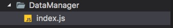

# 编码规范
<li>好的编码规范可以尽可能的减少一个软件的维护成本 , 并且几乎没有任何一个软件，在其整个生命周期中，均由最初的开发人员来维护；</li>
<li>好的编码规范可以改善软件的可读性，可以让开发人员尽快而彻底地理解新的代码；</li>
<li>好的编码规范可以最大限度的提高团队开发的合作效率；</li>
<li>长期的规范性编码还可以让开发人员养成好的编码习惯，甚至锻炼出更加严谨的思维；</li>

#### 1.命名规范
<b>驼峰式命名法介绍：驼峰式命名法由小(大)写字母开始，后续每个单词首字母都大写。</b><br />
按照第一个字母是否大写，分为：<br />
① Pascal Case 大驼峰式命名法：首字母大写。eg：StudentInfo、UserInfo、ProductInfo<br />
② Camel Case 小驼峰式命名法：首字母小写。eg：studentInfo、userInfo、productInfo

###### 1.1变量命名
<b>命名方法：</b>小驼峰式命名法。<br />
<b>命名规范：</b>前缀应当是名词。(函数的名字前缀为动词，以此区分变量和函数)<br />
<b>命名建议：</b>尽量在变量名字中体现所属类型，如:length、count等表示数字类型；而包含name、title表示为字符串类型。<br />
示例：

```
//好的命名方式
var maxCount = 10;
var tableTitle = 'LoginTable';

//不好的命名方式
var setCount = 10;
var getTile = 'LginTale';
```
###### 1.2函数命名
<b>命名方法：</b>小驼峰式命名法。<br />
<b>命名规范：</b>前缀应当为动词。<br />
<b>命名建议：</b>可使用常见动词约定。<br />
<table>
   <tr>
     <td>动词 </td>
     <td>含义 </td>
     <td>返回值</td>
   </tr>
   <tr>
     <td> can</td>
     <td> 判断是否可执行某个动作（权限）</td>
     <td>返回bool：true，false</td>
   </tr>
   <tr>
     <td> has</td>
     <td> 判断是否含有某个值</td>
     <td>返回bool：true，false</td>
   </tr>
   <tr>
     <td>is </td>
     <td>判断是否为某个值 </td>
     <td>返回bool：true，false</td>
   </tr>
   <tr>
     <td>get </td>
     <td> 获取某个值</td>
     <td>函数返回一个非bool值</td>
   </tr>
   <tr>
     <td> set</td>
     <td> 设置某个值</td>
     <td>无返回值，返回是否设置成功</td>
   </tr>
   <tr>
     <td>load </td>
     <td> 加载某些数据</td>
     <td>无返回值或返回是否加载完成</td>
   </tr>
</table>
示例：

```
//是否可阅读
function canRead() {
   return true;
}

//获取名称
function getName() {
   return this;
}
```

###### 1.3 常量命名
<b>命名方法：</b>名称全部大写或首字母大写。<br />
<b>命名规范：</b>使用大写字母和下划线来组合命名，下划线用以分割单词。<br />
<b>命名建议：</b>无。<br />
示例：

```
const MAX_COUNT = 10;//Max_Count
const URL = 'http://www.baidu.com';
```
###### 1.4 构造函数命名
<b>介绍：</b>构造函数也属于函数的一种，只不过采用new 运算符创建对象。<br />
<b>命名方法：</b>大驼峰式命名法，首字母大写。<br />
<b>命名规范：</b>前缀为名称。<br />
<b>命名建议：</b>无。<br />
示例：

```
function Student(name) {
   this.name = name;
}
let st = new Student('tom');
```
###### 1.5 类成员命名
类的成员包含：<br />
① 公共属性和方法：跟变量和函数的命名一样。<br />
② 私有属性和方法：前缀为_(下划线)，后面跟公共属性和方法一样的命名方式。<br />
示例：

```
function Student(name) {
   var _name = name;//私有成员
   //公共方式
   this.setName = function () {
     _name = value;
   }
}

var st = new Student('tom');
st.setName('jerry');
console.log(st.getname()); // =>jerry:输出_name私有变量的值
 
```

###### 1.6 全局变量、常量命名规范
为了区分项目新老变化，对于全局变量、常量的命名采用使用小驼峰式命名;同时为了方便以后管理，采用分类管理

示例：

```

Object.assign(global, {

    //本地资源类型全局
    source: {
        imagesSource: images,
    },

    //框架提供的全局方法
    RypYo: {
        toastShow: RypYo.toastShow,
        runLoading: RypYo.runLoading,
        closeLoading: RypYo.closeLoading
    },
    
    //主题类型全局
    theme: {
        screenW: deviceWidth,
        screenH: deviceHeight,
    },
    //布局工具类可定义的全局
    layout: {
        scaleSize: scaleSize
    }


})
```

#### 2. 注释规范

###### 2.1 单行注释
 使用方式：<br />
      ① 单独一行：//(双斜线)与注释文字之间保留一个空格。<br />
      ② 在代码后面添加注释：//(双斜线)与代码之间保留一个空格，并且//(双斜线)与注释文字之间保留一个空格。<br />
      ③ 注释代码：//(双斜线)与代码之间保留一个空格。<br />
使用场景： <br />&nbsp;&nbsp;&nbsp;&nbsp;&nbsp;
       ① 声明变量、常量、方法名时，在其上方一行进行注释<br />&nbsp;&nbsp;&nbsp;&nbsp;&nbsp;
       ② 注释代码<br />

###### 2.2多行注释及函数注释
注释要尽量简单，清晰明了。着重注释的意思，对不太直观的部分进行注解：<br />
使用方法：<br />
      ① 若开始(/\*)和结束(\*/)都在一行，推荐采用单行注释。<br />
      ② 若至少三行注释时，第一行为/\*，最后行为*/，其他行以开始，并且注释文字与保留一个空格。<br />
<pre>
注释名	语法	含义	示例:<br />
	@param 参数名 {参数类型}  描述信息	描述参数的信息	@param name {String} 传入名称<br />
	@return {返回类型} 描述信息	描述返回值的信息	@return {Boolean} true:可执行;false:不可执行<br />
	@author 作者信息 [附属信息：如邮箱、日期]	描述此函数作者的信息	@author 张三 2015/07/21<br />
	@version XX.XX.XX	描述此函数的版本号	@version 1.0.3<br />
	@example 示例代码	演示函数的使用	@example setTitle('测试') <br />
</pre>

#### 3. 布局规范

###### 3.1空格
a）var与变量名之间留一个空格，变量名与等号之间留一个空格，等号与初始值之间留一个空格，初始值与分号之间不留空格。如：var i = 10; 

b）使用字面量方式声明引用类型变量时，各个属性与冒号之间不留空格，冒号与初始值之间留一个空格。如： 

var Person = { 
age: 16, 
name: "Sam" 
}; 

c）function与函数名之间留一个空格，函数名与()之间不留空格，()与{之间留一个空格。 

d）函数的各个参数之间留一个空格。 

e）if、while、for与左括号之间留一个空格，以强调关键字；switch、with与左括号之间不留空格。 

f) 二元操作符与左右两个操作数之间留一个空格。当某行代码较长时，也可不留空格。 

###### 3.2换行
a）每行语句占用一行，不要多个语句一行。 

b）if、while、for等块级作用域后的大括号{不要另起一行，就放在关键字同一行。

###### 3.3缩进
a）缩进使用4个空格，不要使用tab。
 
b）作用域不一样时就应当进行缩进，以显示出其层次关系。 

#### 4. 有关ES6代码规范

<b>(1）ES6提出了两个新的声明变量的命令：let 和 const 。 建议不再使用var，而使用let 和const 。优先使用const。</b>

```
//bad
var a = 1, b =2 , c = 3;
// good
const [a,b,c] = [1,2,3];
```
<b>（2）静态字符串一律使用单引号或反引号，不建议使用双引号。动态字符使用反引号。</b>

```
//bad 
 const a = "foobar";
 const b = 'foo'+a+'bb';

// good 
const a = 'foobar';
const b = `foo${a}bar`;
```

<b>（3）优先使用结构体赋值; 函数的参数如果是对象的成员，优先使用解构赋值。</b>

```
const arr = [1, 2, 3, 4];

// bad
const first = arr[0];
const second = arr[1];

// good
const [first, second] = arr;
```
```
// bad
function getFullName(user) {
  const firstName = user.firstName;
  const lastName = user.lastName;
}

// good
function getFullName(obj) {
  const { firstName, lastName } = obj;
}

// best
function getFullName({ firstName, lastName }) {
}
```
<b>4）如果函数返回多个值，优先使用对象的解构赋值，而不是数组的解构赋值。这样便于以后添加返回值，以及更改返回值的顺序。</b>

```
// bad
function processInput(input) {
  return [left, right, top, bottom];
}

// good
function processInput(input) {
  return { left, right, top, bottom };
}

const { left, right } = processInput(input);
```
<b>（5）对象的属性和方法尽量采用简洁表达法，这样易于描述和书写</b>

```
// bad 
var ref = 'some value';
const atom = {
  ref:ref,
  value:1,
  addValue:function(value){
    return atom.value + value;
  },
}

//  good 
const atom = {
  ref,
  value:1,
  addValue(value){
    return atom.value + value;
  }
}
```

#### 5. 项目中基本要求
（1）项目中列表页，刚进入时默认使用空白页，待数据加载完时，再区分无数据还是有数据页面；

（2）使用一些加载数据时，使用前先判断是否有数据，避免数据延迟或错误出现不知名崩溃问题；

（3）项目中，无用代码要删除，特殊地方做好注释


#### 6. 其他注意点
 规范

* 模块规范
	* [模块规范](./模块设计规范.md)
	
* 文件规范
	* 文件夹 | 文件名
		* 首字母大写 驼峰标识
	
* 代码规范
  * 头部标识(文件说明)

	  	```
	  	VsCode 插件fileheader
	  	
	  	/*
	  	 * @Creator: mikey.zhaopeng
	  	 * @Date:   2016-07-29 15:57:29
	  	 * @Last Modified by: mikey.zhaopeng
	  	 * @Last Modified time: 2016-08-09 13:29:41
	  	 * @Desc 该文件描述
	  	 */
	  	```
  	
  * 方法
  
	  	* 注释(必要参数说明 和 方法解释)
	  	
	  		```
	  		/**
	  	     * 替换默认拦截器
	  	     * @param {*} key 需要替换的拦截器key值
	  	     * @param {*} interceptor 替换成哪个拦截器
	  	     * 返回替换的拦截器
	  	     */
	  	    replaceInterceptor(key, interceptor) {
	  	    
	  	    }
	  		```
	  	* 声明
	  	
	  		```
	  		class Student{
	  			//第一种声明
	  			/**
	  			* 推荐
	  			*/
	  			method1=()=>{}
	  			//第二中声明
	  			method2(){}
	  		}
	  		```
	  	* 权限（私有和公开）
	  		* javascript 没有publish protect private
	  		* 规定 下划线方法为私有方法
	  		
	  			```
	  			公开方法  外部可以拿到对象直接调用该方法
	  			addInterceptor = (interceptor) => {};
	  			私有方法  下划线开头
	  			_addInterceptor = (interceptor) => {};
	  			```
	  	
	  	* this
	
	  		```
	  			fetch().then(()=>{
	  				this
	  			})
	  		```
	  		* 方法统一使用 箭头函数()=>{}
	  		* function(){} 函数直接绑定
	  		
	  			```
	  			function(){}.bind(this)
	  			```
  * state状态声明
	  * 组件初始方法中,声明所有使用的变量名
	  * 简单明了的解释变量含义
  	
	  	```
	  		constructor(props) {
	  			this.state = {
	  				sex:"",//用户性别
	  				data:[]//列表数据
	  			}
	  		}
	  	```
	  	
  * 图片资源导入
  	
	  	```
	  	组件图片统一加载
	  	this.userImage = images.home.userImage()
	  	render(){
	  		return (
	  			<Image source = {this.userImage}></Image>
	  		)
	  	}
	  	```
	  	
  * render
	
    	 * 只进行简单的数据处理，复杂数据处理的需要单独处理
	    * 不容许进行出现 setState | 网络请求代码 | 耗时操作 await
  	
* 工具类导出
	* 文件 + index.js 
	
		
	* 单例工具类
	
		```
		class GlobalTool{}
		
		export default new GlobalTool()
		```
	
* 资源导出

	* 图片 
	
		```
		使用方法调用加载 ，防止图片没使用就已经加载
			icon:()=>{
				return require("......")
			}
		```


#### 7.总结项目中需要规范的地方 
 * 全局常量名称命名规范
 * 类中定义的常量、变量、函数（方法）、类及文件头的注释规范
 * 文件、文件夹、类名、函数（方法）名的名称命名的规范
 * 无用代码的删除保留处理
 * 区分私有方法与提供外部调用的方法的规范
 


